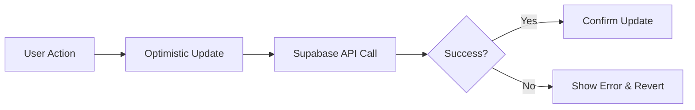

# Ideas Feature - Complete Refactoring

## Overview
The Ideas feature has been completely refactored to provide a better user experience for managing travel ideas, including photos, links, and attachments. Users can now easily convert ideas into activities.

## Key Changes

### 1. Enhanced UI/UX in IdeasTab.tsx

#### Photo Gallery
- **Visual Grid Display**: Photos are now displayed in a 3-column grid with aspect-ratio squares
- **Thumbnail Loading**: Photos load asynchronously with signed URLs from Supabase Storage
- **Full-Screen Viewer**: Click on any photo to view it in a full-screen modal overlay
- **Easy Management**: Delete photos directly from the grid when in edit mode

#### Improved Link Management
- **Inline Form**: Add links with optional labels directly in the edit mode
- **Better Display**: Links show with icons and can be labeled for clarity
- **Quick Delete**: Remove links with a single click (with confirmation)

#### Attachment Handling
- **Multiple Upload**: Support for uploading multiple files at once
- **Visual Badges**: Attachments displayed as clickable badges with file names
- **Type Separation**: Photos and attachments are clearly separated in the UI

### 2. Convert to Activity Feature

#### Functionality
- **One-Click Conversion**: Transform any idea into an itinerary activity
- **Data Mapping**:
  - `Idea.title` → `ItineraryItem.title`
  - `Idea.notes` → `ItineraryItem.description`
  - `Idea.maps_url` → Added to description
  - All links → Added to description as a formatted list
- **Visual Feedback**: Loading spinner during conversion
- **Auto-Navigation**: Automatically switches to the Itinerary tab after conversion

#### Implementation Details
```typescript
const convertIdeaToActivity = async (idea: Idea) => {
  // Creates a new itinerary item with:
  // - Same title and visibility
  // - Combined description from notes, maps URL, and links
  // - Default start/end times (current timestamp)
  // - Zero amount with default currency
};
```

### 3. Edit Mode Improvements

#### Seamless Editing
- **In-Place Editing**: Edit ideas directly in their card without modal dialogs
- **Live Updates**: Changes are saved with optimistic UI updates
- **Asset Management**: Add/remove photos, links, and attachments while editing
- **Form Validation**: Required fields are validated before saving

#### User Permissions
- **Owner Control**: Only the creator or admins can edit/delete ideas
- **Visual Indicators**: Edit/delete buttons only visible to authorized users
- **Private Ideas**: Lock icon indicates private visibility

### 4. Photo Viewer Modal

#### Features
- **Full-Screen Display**: View photos in a dark overlay modal
- **Click to Close**: Click anywhere outside the image to close
- **Close Button**: Explicit close button in the top-right corner
- **Responsive**: Works on all screen sizes

### 5. Component Architecture

#### PhotoThumbnail Component
```typescript
function PhotoThumbnail({ asset }: { asset: IdeaAsset }) {
  // Loads signed URL from Supabase Storage
  // Displays loading spinner while fetching
  // Shows error state if URL fails to load
  // Renders image with object-cover for proper aspect ratio
}
```

## User Flow

### Creating an Idea
1. Click the floating action button (+)
2. Fill in title (required), notes, and Google Maps URL
3. Mark as private if needed
4. Save the idea
5. Edit the idea to add photos, links, and attachments

### Editing an Idea
1. Click the edit icon (pencil) on any idea card
2. Modify title, notes, or maps URL
3. Add links using the "Link" button
4. Upload photos using the "Foto" button
5. Upload attachments using the "Anexo" button
6. Delete any link/photo/attachment by clicking the trash icon
7. Save changes or cancel

### Converting to Activity
1. Click the "Convert to Activity" button (CopyPlus icon)
2. Wait for the conversion (loading spinner)
3. Automatically redirected to the Itinerary tab
4. Find the new activity with all the idea's information

### Viewing Photos
1. Click on any photo thumbnail in the gallery
2. View full-size image in modal
3. Click outside or on the X button to close

## Technical Details

### State Management
- **Local State**: Edit mode, link forms, photo viewer
- **Optimistic Updates**: All mutations update UI immediately before server confirmation
- **Memoized Data**: Links and assets grouped by idea ID for performance

### File Upload
- **Storage Path**: `{tripId}/{memberId}/ideas/{ideaId}/{filename}`
- **Multiple Files**: Supports uploading multiple files at once
- **File Types**: 
  - Photos: `accept="image/*"`
  - Attachments: All file types accepted

### Data Flow


## API Endpoints Used

### Supabase Tables
- `ideas`: Main idea records
- `idea_links`: URL links associated with ideas
- `idea_assets`: Photos and attachments
- `itinerary`: Activities (for conversion)

### Storage Buckets
- `DOCS_BUCKET`: Stores all photos and attachments

## Styling

### Visual Design
- **Card Layout**: Clean, modern cards with rounded corners
- **Grid System**: Responsive 2-column grid (1 column on mobile)
- **Color Scheme**: Uses CSS variables for theming
- **Hover Effects**: Subtle transitions on interactive elements
- **Loading States**: Spinners for async operations

### Responsive Behavior
- **Mobile**: Single column layout, touch-friendly buttons
- **Tablet**: 2-column grid
- **Desktop**: 2-column grid with hover effects

## Future Enhancements

### Potential Improvements
1. **Drag & Drop**: Reorder photos in the gallery
2. **Bulk Operations**: Select multiple ideas to convert or delete
3. **Tags/Categories**: Organize ideas with custom tags
4. **Sharing**: Share ideas with specific trip members
5. **Templates**: Create idea templates for common activities
6. **Map Integration**: Show all ideas on a map view
7. **Cost Estimation**: Add estimated costs to ideas
8. **Voting**: Let trip members vote on ideas

## Migration Notes

### Breaking Changes
- None - the refactoring is backward compatible with existing data

### Database Schema
- No changes required - existing schema supports all new features

### User Impact
- Improved UX with no data loss
- All existing ideas, links, and assets remain intact
- New features available immediately

## Testing Checklist

- [x] Create new idea with title, notes, and maps URL
- [x] Edit existing idea
- [x] Add photos to an idea
- [x] Add links to an idea
- [x] Add attachments to an idea
- [x] Delete photos, links, and attachments
- [x] View photos in full-screen modal
- [x] Convert idea to activity
- [x] Delete entire idea (with all assets)
- [x] Private/public visibility toggle
- [x] Permission checks (owner/admin only)
- [x] Responsive layout on mobile/tablet/desktop
- [x] Loading states and error handling
- [x] Optimistic updates with rollback on error

## Code Quality

### Best Practices
- **TypeScript**: Full type safety with proper interfaces
- **React Hooks**: Proper use of useState, useMemo, useEffect
- **Async/Await**: Clean async code with error handling
- **Component Composition**: Reusable PhotoThumbnail component
- **Accessibility**: ARIA labels and semantic HTML
- **Performance**: Memoized computations, optimistic updates

### Error Handling
- User-friendly error messages via `getErrorMessage()`
- Confirmation dialogs for destructive actions
- Graceful fallbacks for failed image loads
- Storage cleanup on deletion failures

## Documentation

### Code Comments
- Clear function names and variable names
- JSDoc comments for complex logic
- Inline comments for non-obvious code

### User Documentation
- Tooltip hints on buttons
- Placeholder text in forms
- Help text for complex features

## Conclusion

The Ideas feature is now a powerful tool for trip planning, allowing users to:
- Collect inspiration with photos and links
- Organize information in a visual, intuitive way
- Seamlessly convert ideas into concrete activities
- Manage all aspects of their travel ideas in one place

The refactoring maintains backward compatibility while significantly improving the user experience and adding highly requested features.
