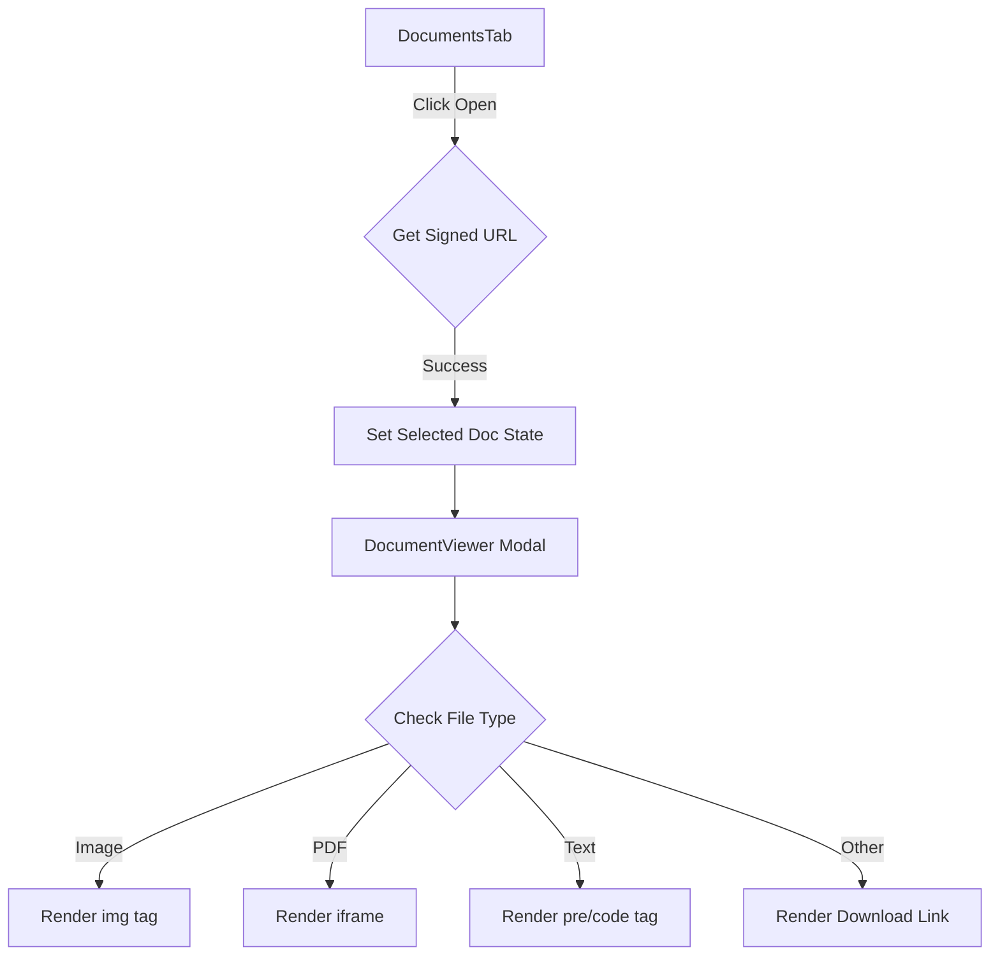

# Plan: Document Visualization Implementation

This plan outlines the steps to implement a document viewer modal for the Travel Planner application, supporting photos, PDFs, and text files.

## Proposed Architecture

We will create a specialized `DocumentViewer` component that uses the existing `Modal` component. The viewer will detect the file type based on the extension or MIME type and render the appropriate preview element.

### File Type Handling
- **Images (jpg, png, webp):** Rendered using an `` tag with `object-contain`.
- **PDFs:** Rendered using an `<iframe>` or `<embed>` tag.
- **Text (txt):** Rendered in a scrollable `<pre>` block or `<iframe>`.
- **Other (doc, docx):** Since browsers cannot natively render Word docs, we will provide a clear download button and a file icon placeholder.

## Mermaid Diagram

## Proposed Changes

### 1. `src/components/DocumentViewer.tsx` (New)
A component to encapsulate the logic of displaying different file types.

### 2. `src/components/tabs/DocumentsTab.tsx`
- Update `accept` attribute in the file input to include `.txt, .doc, .docx`.
- Add state for `selectedDocument` (URL and Name).
- Replace `window.open` with a call to open the new viewer modal.

### 3. `src/types/index.ts`
Ensure document types are correctly defined if needed.

---
Are you satisfied with this plan? If so, I will switch to Code mode to begin implementation.
