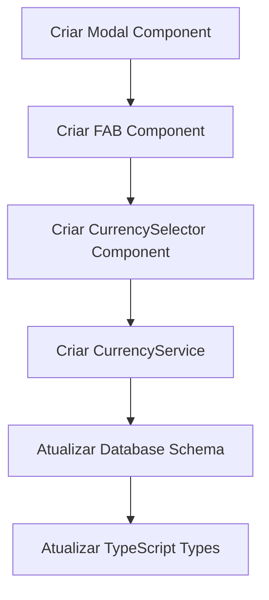
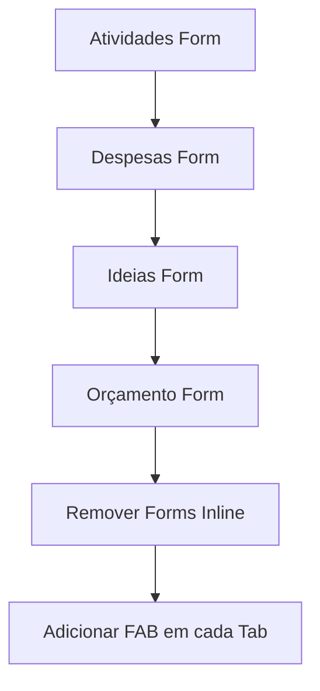
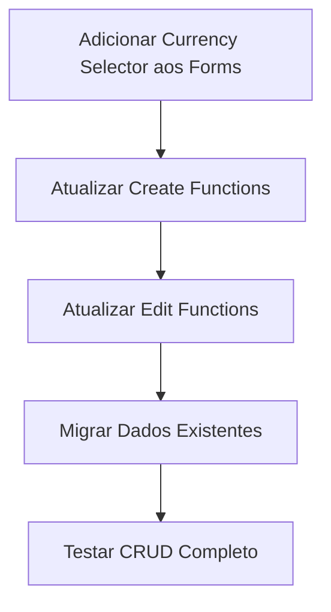
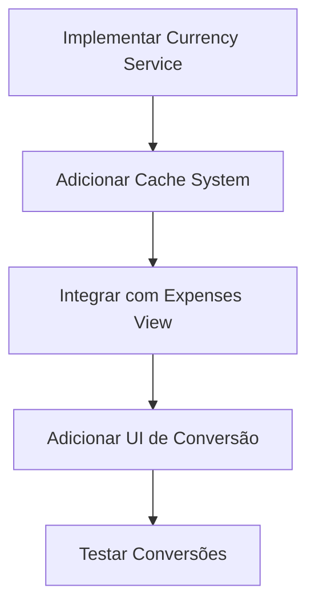

# Plano: Floating Action Button (FAB) + Modal Forms + Multi-Currency Support

## Visão Geral

Este plano detalha a implementação de três melhorias principais no aplicativo de planejamento de viagens:

1. **Substituir formulários inline por modais** - Remover os formulários de entrada embutidos nas páginas e substituí-los por um botão flutuante "+" que abre modais
2. **Suporte multi-moeda** - Adicionar seletor de moeda para todos os campos de valor (Ideias, Atividades, Despesas, Orçamento)
3. **Conversão de moeda em Despesas** - Converter automaticamente valores de despesas para a moeda padrão usando taxa de câmbio do dia

## Análise do Estado Atual

### Formulários Existentes

Atualmente, os seguintes formulários estão embutidos nas páginas:

1. **Atividades (Itinerary)** - [`TripDashboard.tsx:1402-1425`](src/components/TripDashboard.tsx:1402)
   - Campos: type, title, location, amount, description, is_private
   - Localização: Coluna lateral direita na grid

2. **Despesas (Expenses)** - [`TripDashboard.tsx:1781-1808`](src/components/TripDashboard.tsx:1781)
   - Campos: description, category_id, amount, is_private
   - Localização: Abaixo da lista de despesas

3. **Ideias (Ideas)** - [`TripDashboard.tsx:1991-2045`](src/components/TripDashboard.tsx:1991)
   - Campos: title, maps_url, estimated_amount, is_private, URLs, anexos, fotos
   - Localização: Abaixo da grid de ideias

4. **Orçamento (Budget)** - [`TripDashboard.tsx:2248-2272`](src/components/TripDashboard.tsx:2248)
   - Campos: budget_limit
   - Localização: Página de configurações

### Campos com Valores Monetários

Identificados os seguintes campos que precisam de seletor de moeda:

- **Atividades**: `amount` (linha 1415)
- **Despesas**: `amount` (linha 1799)
- **Ideias**: `estimated_amount` (linha 2005)
- **Orçamento**: `budget_limit` (linha 2250)

### Estrutura de Dados Atual

```typescript
// Expense já tem campo currency
interface Expense {
  currency: string; // ✅ Já existe
  amount: number;
}

// Outros precisam adicionar
interface ItineraryItem {
  amount: number;
  // currency: string; // ❌ Precisa adicionar
}

interface Idea {
  estimated_amount: number;
  // currency: string; // ❌ Precisa adicionar
}

interface TripBudget {
  budget_limit: number;
  // currency: string; // ❌ Precisa adicionar
}
```

## Arquitetura da Solução

### 1. Sistema de Modal Unificado

```
┌─────────────────────────────────────────┐
│         Página Principal                │
│  ┌───────────────────────────────────┐  │
│  │   Conteúdo da Tab Ativa           │  │
│  │   (Lista de itens)                │  │
│  │                                   │  │
│  └───────────────────────────────────┘  │
│                                         │
│  ┌─────────────────┐                   │
│  │  FAB Button (+) │ ◄─── Flutuante    │
│  └─────────────────┘                   │
└─────────────────────────────────────────┘
         │
         │ onClick
         ▼
┌─────────────────────────────────────────┐
│     Modal Overlay (backdrop)            │
│  ┌───────────────────────────────────┐  │
│  │   Modal Content                   │  │
│  │  ┌─────────────────────────────┐  │  │
│  │  │  Formulário Específico      │  │  │
│  │  │  (baseado na tab ativa)     │  │  │
│  │  └─────────────────────────────┘  │  │
│  └───────────────────────────────────┘  │
└─────────────────────────────────────────┘
```

### 2. Componentes a Criar

#### 2.1 FloatingActionButton Component

```typescript
// src/components/FloatingActionButton.tsx
interface FloatingActionButtonProps {
  onClick: () => void;
  icon?: React.ReactNode;
  label?: string;
  position?: 'bottom-right' | 'bottom-center';
}
```

**Características:**
- Posição fixa no canto inferior direito (desktop) ou centro (mobile)
- Animação de entrada/saída com framer-motion
- Ícone Plus do lucide-react
- Responsivo: maior no mobile para facilitar toque
- Z-index alto para ficar acima do conteúdo

#### 2.2 Modal Component

```typescript
// src/components/Modal.tsx
interface ModalProps {
  isOpen: boolean;
  onClose: () => void;
  title: string;
  children: React.ReactNode;
  size?: 'sm' | 'md' | 'lg' | 'xl';
}
```

**Características:**
- Backdrop com blur e transparência
- Animação de entrada/saída (framer-motion)
- Fechar ao clicar fora ou pressionar ESC
- Scroll interno quando conteúdo é grande
- Responsivo: fullscreen no mobile, centralizado no desktop

#### 2.3 CurrencySelector Component

```typescript
// src/components/CurrencySelector.tsx
interface CurrencySelectorProps {
  value: string;
  onChange: (currency: string) => void;
  label?: string;
  disabled?: boolean;
}
```

**Moedas Suportadas:**
- BRL (Real Brasileiro) - Padrão
- USD (Dólar Americano)
- EUR (Euro)
- GBP (Libra Esterlina)
- JPY (Iene Japonês)
- ARS (Peso Argentino)
- CLP (Peso Chileno)
- PYG (Guarani Paraguaio)

### 3. Alterações no Banco de Dados

#### 3.1 Schema SQL Updates

```sql
-- Adicionar campo currency às tabelas que ainda não têm

-- Itinerary
ALTER TABLE public.itinerary 
ADD COLUMN IF NOT EXISTS currency TEXT NOT NULL DEFAULT 'BRL';

-- Ideas
ALTER TABLE public.ideas 
ADD COLUMN IF NOT EXISTS currency TEXT NOT NULL DEFAULT 'BRL';

-- Trip Budgets
ALTER TABLE public.trip_budgets 
ADD COLUMN IF NOT EXISTS currency TEXT NOT NULL DEFAULT 'BRL';

-- Adicionar constraint de validação (3 caracteres)
ALTER TABLE public.itinerary
ADD CONSTRAINT itinerary_currency_len_chk 
CHECK (char_length(currency) = 3);

ALTER TABLE public.ideas
ADD CONSTRAINT ideas_currency_len_chk 
CHECK (char_length(currency) = 3);

ALTER TABLE public.trip_budgets
ADD CONSTRAINT trip_budgets_currency_len_chk 
CHECK (char_length(currency) = 3);
```

#### 3.2 TypeScript Types Updates

```typescript
// src/types/index.ts

export interface ItineraryItem {
  id: string;
  trip_id: string;
  created_by_member_id: string;
  type: ItineraryType;
  title: string;
  description: string;
  location: string;
  start_time: string;
  end_time: string;
  amount: number;
  currency: string; // ✅ NOVO
  visibility: Visibility;
  photo_url?: string | null;
}

export interface Idea {
  id: string;
  trip_id: string;
  created_by_member_id: string;
  title: string;
  maps_url: string | null;
  estimated_amount: number;
  currency: string; // ✅ NOVO
  visibility: Visibility;
  created_at: string;
}

export interface TripBudget {
  id: string;
  trip_id: string;
  owner_user_id: string;
  budget_limit: number;
  currency: string; // ✅ NOVO
}
```

### 4. Serviço de Conversão de Moeda

#### 4.1 Exchange Rate API

Usar API gratuita para obter taxas de câmbio:
- **Opção 1**: [ExchangeRate-API](https://www.exchangerate-api.com/) - 1500 requests/mês grátis
- **Opção 2**: [Fixer.io](https://fixer.io/) - 100 requests/mês grátis
- **Opção 3**: [Open Exchange Rates](https://openexchangerates.org/) - 1000 requests/mês grátis

#### 4.2 Currency Service

```typescript
// src/services/currencyService.ts

interface ExchangeRates {
  base: string;
  date: string;
  rates: Record<string, number>;
}

class CurrencyService {
  private cache: Map<string, { rates: ExchangeRates; timestamp: number }>;
  private CACHE_DURATION = 24 * 60 * 60 * 1000; // 24 horas

  async getExchangeRates(baseCurrency: string): Promise<ExchangeRates>;
  
  async convert(
    amount: number,
    fromCurrency: string,
    toCurrency: string
  ): Promise<number>;
  
  formatCurrency(amount: number, currency: string): string;
}
```

**Estratégia de Cache:**
- Cache em memória (Map) para evitar requests repetidos
- Duração: 24 horas
- Fallback: se API falhar, usar taxas do cache mesmo expirado
- LocalStorage: persistir cache entre sessões

#### 4.3 Conversão na Tela de Despesas

```typescript
// Lógica de conversão
const convertedExpenses = expenses.map(expense => {
  if (expense.currency === settings.default_currency) {
    return expense;
  }
  
  const convertedAmount = await currencyService.convert(
    expense.amount,
    expense.currency,
    settings.default_currency
  );
  
  return {
    ...expense,
    originalAmount: expense.amount,
    originalCurrency: expense.currency,
    convertedAmount,
    displayAmount: convertedAmount,
  };
});
```

**UI para Despesas Convertidas:**
```
┌─────────────────────────────────────────┐
│ Jantar no Restaurante                   │
│ 2024-02-25                              │
│                                         │
│ USD 50.00 → BRL 250.00                 │
│ (Taxa: 1 USD = 5.00 BRL)               │
└─────────────────────────────────────────┘
```

## Fluxo de Implementação

### Fase 1: Infraestrutura Base



### Fase 2: Migração de Formulários



### Fase 3: Multi-Currency



### Fase 4: Conversão de Moeda



## Detalhamento das Mudanças

### 1. TripDashboard.tsx - Estado e Lógica

#### 1.1 Novos Estados

```typescript
// Controle de modais
const [showAddModal, setShowAddModal] = useState(false);
const [modalType, setModalType] = useState<'itinerary' | 'expense' | 'idea' | 'budget' | null>(null);

// Currency para cada formulário
const [itineraryCurrency, setItineraryCurrency] = useState(settings.default_currency);
const [expenseCurrency, setExpenseCurrency] = useState(settings.default_currency);
const [ideaCurrency, setIdeaCurrency] = useState(settings.default_currency);
const [budgetCurrency, setBudgetCurrency] = useState(settings.default_currency);

// Exchange rates
const [exchangeRates, setExchangeRates] = useState<ExchangeRates | null>(null);
const [loadingRates, setLoadingRates] = useState(false);
```

#### 1.2 Funções Atualizadas

```typescript
// createItinerary - adicionar currency
const createItinerary = async (form: FormData) => {
  // ... código existente
  const { error } = await supabase.from("itinerary").insert({
    // ... campos existentes
    currency: itineraryCurrency, // ✅ NOVO
  });
};

// createExpense - já tem currency, manter
const createExpense = async (form: FormData) => {
  // ... código existente (já usa settings.default_currency)
  currency: expenseCurrency, // ✅ Usar estado ao invés de settings
};

// createIdea - adicionar currency
const createIdea = async (form: FormData) => {
  // ... código existente
  const { error: ideaError } = await supabase.from("ideas").insert({
    // ... campos existentes
    currency: ideaCurrency, // ✅ NOVO
  });
};

// upsertTripBudget - adicionar currency
const saveTripBudget = async () => {
  // ... código existente
  const { data, error } = await supabase.rpc("upsert_trip_budget", {
    p_trip_id: id,
    p_budget_limit: safeBudget,
    p_currency: budgetCurrency, // ✅ NOVO (precisa atualizar RPC)
  });
};
```

### 2. Layout Changes

#### 2.1 Remover Formulários Inline

**Antes:**
```tsx
<div className="grid grid-cols-1 lg:grid-cols-3 gap-6">
  <div className="lg:col-span-2">
    {/* Lista de itens */}
  </div>
  <Card>
    {/* Formulário inline */}
  </Card>
</div>
```

**Depois:**
```tsx
<div className="space-y-4">
  {/* Apenas lista de itens */}
  {trip.itinerary.map(item => ...)}
</div>

{/* FAB flutuante */}
<FloatingActionButton 
  onClick={() => openModal('itinerary')}
/>

{/* Modal */}
<Modal isOpen={showAddModal && modalType === 'itinerary'}>
  {/* Formulário */}
</Modal>
```

#### 2.2 FAB Positioning

```css
/* Desktop */
.fab-desktop {
  position: fixed;
  bottom: 2rem;
  right: 2rem;
  z-index: 50;
}

/* Mobile - acima da bottom navigation */
.fab-mobile {
  position: fixed;
  bottom: 5rem; /* Acima do nav (4rem) + margem */
  right: 1rem;
  z-index: 50;
}
```

### 3. Modal Forms Structure

#### 3.1 Itinerary Modal Form

```tsx
<Modal isOpen={showAddModal && modalType === 'itinerary'} title="Nova Atividade">
  <form onSubmit={handleCreateItinerary}>
    <div className="space-y-4">
      <select name="type">
        <option value="activity">Atividade</option>
        <option value="flight">Voo</option>
        <option value="bus">Ônibus</option>
        <option value="hotel">Hospedagem</option>
      </select>
      
      <input name="title" required placeholder="Título" />
      <input name="location" placeholder="Local" />
      
      {/* Valor + Moeda */}
      <div className="grid grid-cols-2 gap-3">
        <input 
          name="amount" 
          placeholder="Valor"
          onChange={(e) => (e.target.value = maskCurrency(e.target.value))}
        />
        <CurrencySelector 
          value={itineraryCurrency}
          onChange={setItineraryCurrency}
        />
      </div>
      
      <textarea name="description" placeholder="Notas" />
      
      <label>
        <input type="checkbox" name="is_private" />
        Marcar como privado
      </label>
      
      <button type="submit">Adicionar</button>
    </div>
  </form>
</Modal>
```

#### 3.2 Expense Modal Form

```tsx
<Modal isOpen={showAddModal && modalType === 'expense'} title="Nova Despesa">
  <form onSubmit={handleCreateExpense}>
    <div className="space-y-4">
      <input name="description" required placeholder="Descrição" />
      
      <select name="category_id">
        <option value="">Sem categoria</option>
        {categories.map(cat => (
          <option key={cat.id} value={cat.id}>{cat.name}</option>
        ))}
      </select>
      
      {/* Valor + Moeda */}
      <div className="grid grid-cols-2 gap-3">
        <input 
          name="amount" 
          required
          placeholder="Valor"
          onChange={(e) => (e.target.value = maskCurrency(e.target.value))}
        />
        <CurrencySelector 
          value={expenseCurrency}
          onChange={setExpenseCurrency}
        />
      </div>
      
      <label>
        <input type="checkbox" name="is_private" />
        Marcar como privado
      </label>
      
      <button type="submit">Adicionar</button>
    </div>
  </form>
</Modal>
```

#### 3.3 Idea Modal Form

```tsx
<Modal isOpen={showAddModal && modalType === 'idea'} title="Nova Ideia" size="lg">
  <form onSubmit={handleCreateIdea}>
    <div className="space-y-4">
      <input name="title" required placeholder="Título" />
      <input name="maps_url" placeholder="URL do Google Maps" />
      
      {/* Valor + Moeda */}
      <div className="grid grid-cols-2 gap-3">
        <input 
          name="estimated_amount" 
          placeholder="Valor estimado"
          onChange={(e) => (e.target.value = maskCurrency(e.target.value))}
        />
        <CurrencySelector 
          value={ideaCurrency}
          onChange={setIdeaCurrency}
        />
      </div>
      
      {/* URLs dinâmicas */}
      <div className="space-y-2">
        <label className="font-semibold">URLs</label>
        {ideaLinksDraft.map((value, index) => (
          <div key={index} className="flex gap-2">
            <input 
              value={value}
              onChange={(e) => updateIdeaLink(index, e.target.value)}
              placeholder="https://..."
            />
            {ideaLinksDraft.length > 1 && (
              <button type="button" onClick={() => removeIdeaLink(index)}>
                Remover
              </button>
            )}
          </div>
        ))}
        <button type="button" onClick={addIdeaLink}>
          Adicionar URL
        </button>
      </div>
      
      {/* Anexos e Fotos */}
      <div className="grid grid-cols-2 gap-3">
        <label>
          <span>Anexos</span>
          <input ref={ideaAttachmentInputRef} type="file" multiple />
        </label>
        <label>
          <span>Fotos</span>
          <input ref={ideaPhotoInputRef} type="file" accept="image/*" multiple />
        </label>
      </div>
      
      <label>
        <input type="checkbox" name="is_private" />
        Marcar como privado
      </label>
      
      <button type="submit">Salvar Ideia</button>
    </div>
  </form>
</Modal>
```

### 4. Expenses View - Conversão de Moeda

#### 4.1 Display de Despesas Convertidas

```tsx
{trip.expenses.map((exp) => {
  const needsConversion = exp.currency !== settings.default_currency;
  const convertedAmount = needsConversion 
    ? convertCurrency(exp.amount, exp.currency, settings.default_currency)
    : exp.amount;
  
  return (
    <tr key={exp.id}>
      <td>{exp.description}</td>
      <td>{exp.category?.name || 'Geral'}</td>
      <td>
        {needsConversion ? (
          <div className="space-y-1">
            <div className="font-bold">
              {formatCurrency(convertedAmount, settings.default_currency)}
            </div>
            <div className="text-xs text-zinc-500">
              {formatCurrency(exp.amount, exp.currency)}
              <span className="mx-1">→</span>
              Taxa: {getExchangeRate(exp.currency, settings.default_currency)}
            </div>
          </div>
        ) : (
          <div className="font-bold">
            {formatCurrency(exp.amount, exp.currency)}
          </div>
        )}
      </td>
      {/* ... outras colunas */}
    </tr>
  );
})}
```

#### 4.2 Total de Despesas com Conversão

```tsx
const expensesTotal = useMemo(() => {
  return trip.expenses.reduce((total, expense) => {
    if (expense.currency === settings.default_currency) {
      return total + expense.amount;
    }
    const converted = convertCurrency(
      expense.amount, 
      expense.currency, 
      settings.default_currency
    );
    return total + converted;
  }, 0);
}, [trip.expenses, settings.default_currency, exchangeRates]);
```

## Considerações de UX

### 1. Feedback Visual

- **Loading States**: Mostrar spinner durante conversão de moeda
- **Error States**: Mensagem clara se conversão falhar
- **Success States**: Animação de sucesso ao criar item

### 2. Acessibilidade

- **Keyboard Navigation**: ESC fecha modal, Tab navega entre campos
- **Screen Readers**: Labels apropriados, ARIA attributes
- **Focus Management**: Foco automático no primeiro campo ao abrir modal

### 3. Mobile Optimization

- **Touch Targets**: Botões com mínimo 44x44px
- **Modal Fullscreen**: Modal ocupa tela inteira no mobile
- **FAB Size**: Maior no mobile (56x56px vs 48x48px desktop)
- **Bottom Nav**: FAB posicionado acima da navegação inferior

### 4. Performance

- **Lazy Loading**: Carregar exchange rates apenas quando necessário
- **Debounce**: Evitar requests excessivos durante digitação
- **Memoization**: Usar useMemo para cálculos de conversão
- **Virtual Scrolling**: Se lista de despesas ficar muito grande

## Migração de Dados

### Script de Migração

```sql
-- Migrar dados existentes para incluir currency
-- Usar default_currency do perfil do criador

UPDATE public.itinerary i
SET currency = COALESCE(
  (SELECT p.default_currency 
   FROM public.trip_members tm
   JOIN public.profiles p ON p.user_id = tm.user_id
   WHERE tm.id = i.created_by_member_id),
  'BRL'
)
WHERE currency IS NULL OR currency = '';

UPDATE public.ideas i
SET currency = COALESCE(
  (SELECT p.default_currency 
   FROM public.trip_members tm
   JOIN public.profiles p ON p.user_id = tm.user_id
   WHERE tm.id = i.created_by_member_id),
  'BRL'
)
WHERE currency IS NULL OR currency = '';

UPDATE public.trip_budgets tb
SET currency = COALESCE(
  (SELECT p.default_currency 
   FROM public.profiles p
   WHERE p.user_id = tb.owner_user_id),
  'BRL'
)
WHERE currency IS NULL OR currency = '';
```

## Testes

### 1. Testes Unitários

- [ ] CurrencySelector component
- [ ] CurrencyService.convert()
- [ ] CurrencyService.getExchangeRates()
- [ ] Modal component open/close
- [ ] FAB component click handler

### 2. Testes de Integração

- [ ] Criar atividade com moeda diferente
- [ ] Criar despesa com moeda diferente
- [ ] Criar ideia com moeda diferente
- [ ] Editar item e mudar moeda
- [ ] Conversão de despesas na visualização
- [ ] Cache de exchange rates

### 3. Testes E2E

- [ ] Fluxo completo: abrir modal → preencher → salvar → visualizar
- [ ] Conversão de moeda em tempo real
- [ ] Navegação entre tabs com FAB
- [ ] Responsividade mobile/desktop
- [ ] Offline behavior (cache)

## Cronograma Estimado

### Sprint 1: Infraestrutura (3-4 dias)
- Criar componentes base (Modal, FAB, CurrencySelector)
- Implementar CurrencyService
- Atualizar schema do banco de dados
- Atualizar TypeScript types

### Sprint 2: Migração de Forms (3-4 dias)
- Migrar formulário de Atividades
- Migrar formulário de Despesas
- Migrar formulário de Ideias
- Migrar formulário de Orçamento
- Remover forms inline

### Sprint 3: Multi-Currency (2-3 dias)
- Adicionar currency selector a todos os forms
- Atualizar funções de create/update
- Migrar dados existentes
- Testes de CRUD

### Sprint 4: Conversão (2-3 dias)
- Implementar conversão na view de despesas
- Adicionar UI de conversão
- Implementar cache de rates
- Testes de conversão

### Sprint 5: Polish & Testing (2 dias)
- Ajustes de UX/UI
- Testes completos
- Correção de bugs
- Documentação

**Total: 12-16 dias de desenvolvimento**

## Riscos e Mitigações

### Risco 1: API de Exchange Rate Indisponível
**Mitigação**: 
- Implementar fallback com taxas fixas
- Cache persistente em localStorage
- Múltiplas APIs como backup

### Risco 2: Performance com Muitas Conversões
**Mitigação**:
- Memoização agressiva
- Batch conversion requests
- Virtual scrolling para listas grandes

### Risco 3: Complexidade de Migração de Dados
**Mitigação**:
- Script de migração testado em ambiente de dev
- Backup antes da migração
- Rollback plan

### Risco 4: UX Confusa com Múltiplas Moedas
**Mitigação**:
- Indicadores visuais claros
- Tooltips explicativos
- Documentação de ajuda

## Próximos Passos

1. **Revisar e aprovar este plano** com stakeholders
2. **Criar issues/tasks** no sistema de gerenciamento
3. **Configurar ambiente de desenvolvimento** com API keys
4. **Iniciar Sprint 1** com componentes base
5. **Iterações semanais** com demos e feedback

## Referências

- [Framer Motion Docs](https://www.framer.com/motion/)
- [ExchangeRate-API](https://www.exchangerate-api.com/docs)
- [Material Design FAB](https://m3.material.io/components/floating-action-button)
- [Supabase RPC Functions](https://supabase.com/docs/guides/database/functions)
