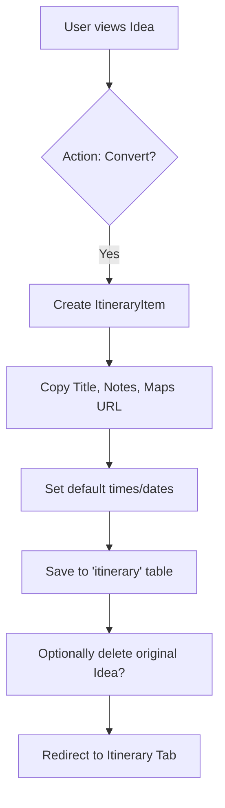

# Plan: Ideas Refactoring

## Overview
Refactor the "Ideas" feature to allow users to register interesting things for their trip, including photos and links. The system will support editing, removing attachments/links, and converting an idea into a formal activity (itinerary item).

## Architecture Changes

### 1. Data Model
- The current `Idea`, `IdeaLink`, and `IdeaAsset` types in [`src/types/index.ts`](src/types/index.ts) are sufficient.
- No database schema changes are expected as the current structure already supports links and assets.

### 2. UI/UX Improvements
- **IdeasTab.tsx**: 
    - Implement an image gallery/grid for `IdeaAsset` of type `photo`.
    - Improve the "Edit" mode to allow managing links and photos more intuitively.
    - Add a "Convert to Activity" button that moves/copies the idea to the itinerary.
- **TripDashboard.tsx**:
    - Update the "New Idea" modal to potentially allow adding links/photos immediately (or ensure the transition to the edit state is seamless).

### 3. Conversion Logic (Idea -> Activity)
- When converting:
    - Create a new `ItineraryItem`.
    - Map `Idea.title` to `ItineraryItem.title`.
    - Map `Idea.notes` and `Idea.maps_url` to `ItineraryItem.description`.
    - (Optional) Move or reference `IdeaAsset` in the new activity if the schema allows (currently `ItineraryItem` has a single `photo_url`).

## Mermaid Diagram: Conversion Flow

## Proposed Steps
1.  **Refactor `IdeasTab.tsx`**: Update the card layout to include a photo grid and better link management.
2.  **Implement Conversion**: Add the logic to `copyIdeaToItinerary` (or a new `convertToActivity` function) to handle the transformation.
3.  **Update Modals**: Ensure the creation flow is smooth.
