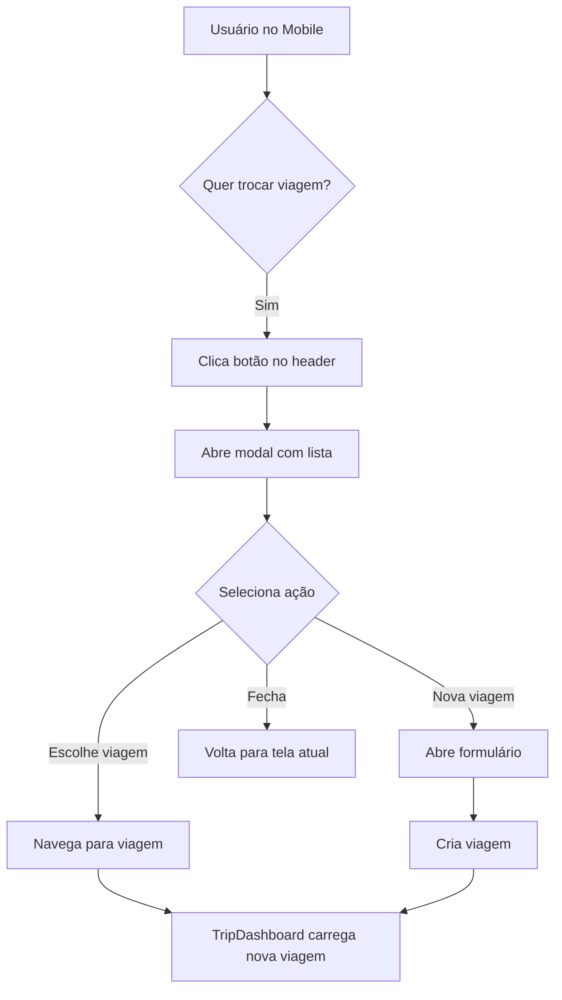
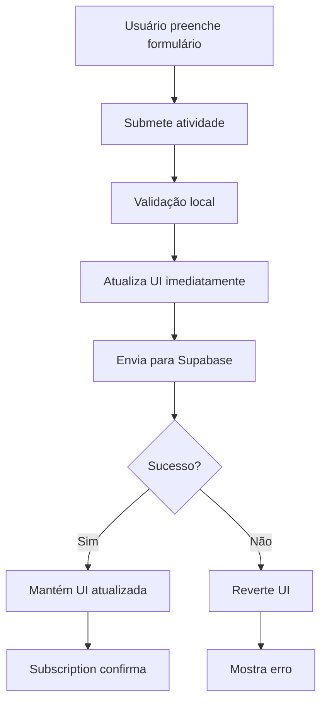
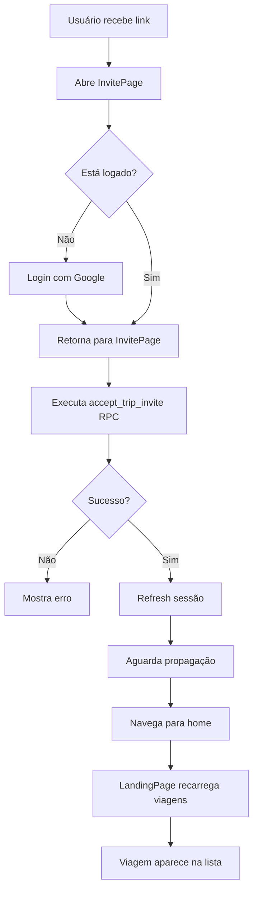

# Plano de Melhorias Mobile - Travel Planner

## Resumo dos Problemas Identificados

1. **Seletor de viagens ausente no mobile** - Usuários não conseguem trocar de viagem
2. **Atualização manual necessária** - Ao adicionar atividade, precisa refresh
3. **Problemas de responsividade** - Telas não se ajustam bem ao mobile
4. **Falta máscara monetária** - Campo de valor estimado em ideias sem formatação
5. **UX inconsistente em ideias** - Formulário aparece antes da lista
6. **UX inconsistente em despesas** - Formulário aparece antes da lista
7. **Bug de convite** - Viagem não aparece na lista após aceitar convite

---

## Análise Técnica

### 1. Seletor de Viagens no Mobile

**Problema Atual:**
- A sidebar com lista de viagens está oculta no mobile (`hidden md:flex`)
- Não há alternativa para trocar de viagem em telas pequenas
- Usuário fica "preso" na viagem atual

**Solução Proposta:**
Adicionar um dropdown/modal no header mobile que permita:
- Ver lista de viagens disponíveis
- Navegar para outra viagem
- Criar nova viagem

**Implementação:**
- Adicionar botão no header (visível apenas em mobile)
- Criar modal/dropdown com lista de viagens
- Reutilizar lógica existente de `tripOptions` e navegação

**Arquivos Afetados:**
- [`src/components/TripDashboard.tsx`](src/components/TripDashboard.tsx) - linhas 1154-1173 (header)

---

### 2. Atualização Automática da UI

**Problema Atual:**
- Ao adicionar atividade via formulário (linha 1314-1334), o formulário é resetado
- Mas a UI não reflete a nova atividade imediatamente
- Depende do realtime subscription do Supabase para atualizar

**Solução Proposta:**
Atualizar o estado local imediatamente após inserção bem-sucedida:
- Após `createItinerary` ter sucesso, adicionar item ao estado `trip.itinerary`
- Usar atualização otimista (optimistic update)
- Manter subscription como backup

**Implementação:**
```typescript
// Após inserção bem-sucedida
setTrip((prev) => {
  if (!prev) return prev;
  return {
    ...prev,
    itinerary: [...prev.itinerary, newItem].sort((a, b) => 
      new Date(a.start_time).getTime() - new Date(b.start_time).getTime()
    ),
  };
});
```

**Arquivos Afetados:**
- [`src/components/TripDashboard.tsx`](src/components/TripDashboard.tsx) - função `createItinerary` (linhas 485-527)

**Nota:** Padrão similar já existe para ideias (linhas 578-585) e itinerário edit (linhas 797-815)

---

### 3. Ajustes de Responsividade

**Problemas Identificados:**

#### 3.1 Header da Viagem
- Título pode quebrar em telas pequenas
- Badge de Admin pode sobrepor conteúdo

#### 3.2 Cards de Atividades
- Botões de ação podem ficar apertados
- Foto ocupa muito espaço vertical
- Campos de edição podem transbordar

#### 3.3 Formulários
- Inputs podem ser muito largos
- Botões podem ficar pequenos demais para toque
- Espaçamento inadequado

#### 3.4 Tabelas
- Tabela de despesas já tem versão mobile (linhas 1489-1599) ✓
- Tabela de pessoas precisa de versão mobile

**Soluções Propostas:**

1. **Header:** Usar `flex-col` em mobile, `flex-row` em desktop
2. **Cards:** Ajustar padding, tamanhos de fonte e espaçamento
3. **Formulários:** Aumentar `min-height` de botões para 44px (padrão touch)
4. **Tabelas:** Criar versão card para mobile (similar a despesas)

**Arquivos Afetados:**
- [`src/components/TripDashboard.tsx`](src/components/TripDashboard.tsx) - múltiplas seções

---

### 4. Máscara Monetária em Ideias

**Problema Atual:**
- Campo `estimated_amount` usa `type="number"` (linha 1654)
- Não tem formatação monetária como outros campos
- Inconsistente com campos de valor em atividades e despesas

**Solução Proposta:**
Aplicar mesma máscara usada em outros lugares:
- Usar `maskCurrency` do utils
- Converter com `parseCurrencyToNumber` ao salvar
- Manter consistência visual

**Implementação:**
```typescript
// No formulário de criar ideia
<input
  name="estimated_amount"
  placeholder="Valor estimado (opcional)"
  className="px-3 py-2 rounded-xl border border-zinc-200 text-sm"
  onChange={(e) => (e.target.value = maskCurrency(e.target.value))}
/>

// Na função createIdea
const estimatedAmount = parseCurrencyToNumber(form.get("estimated_amount") as string) || 0;
```

**Arquivos Afetados:**
- [`src/components/TripDashboard.tsx`](src/components/TripDashboard.tsx) - linhas 1654 (formulário) e 547-630 (função createIdea)
- Também aplicar no formulário de edição (linhas 1717-1725)

---

### 5. Reorganizar Tela de Ideias

**Problema Atual:**
- Formulário "Adicionar ideia" aparece primeiro (linhas 1641-1690)
- Lista de ideias aparece depois (linhas 1692-1871)
- UX confusa: usuário vê formulário antes de ver o que já existe

**Solução Proposta:**
Inverter ordem:
1. Mostrar lista de ideias existentes primeiro
2. Formulário de adicionar no final
3. Adicionar título "Minhas Ideias" ou similar

**Implementação:**
Reorganizar JSX dentro do bloco `activeTab === "ideas"`:
```typescript
{activeTab === "ideas" && (
  <motion.div>
    {/* Lista de ideias primeiro */}
    <div className="grid grid-cols-1 sm:grid-cols-2 gap-4 mb-6">
      {trip.ideas.map((idea) => (...))}
    </div>
    
    {/* Formulário depois */}
    <Card>
      <h3 className="font-bold mb-4">Adicionar ideia</h3>
      <form>...</form>
    </Card>
  </motion.div>
)}
```

**Arquivos Afetados:**
- [`src/components/TripDashboard.tsx`](src/components/TripDashboard.tsx) - linhas 1639-1872

---

### 6. Reorganizar Tela de Despesas

**Problema Atual:**
- Formulário "Adicionar despesa" aparece primeiro (linhas 1342-1369)
- Tabela/lista de despesas aparece depois (linhas 1371-1599)
- Mesma inconsistência de UX que ideias

**Solução Proposta:**
Inverter ordem:
1. Mostrar resumo de orçamento primeiro (já está no final, mover para cima)
2. Mostrar lista/tabela de despesas
3. Formulário de adicionar no final

**Implementação:**
Reorganizar JSX dentro do bloco `activeTab === "expenses"`:
```typescript
{activeTab === "expenses" && (
  <motion.div>
    {/* Resumo de orçamento */}
    <Card>Total e orçamento...</Card>
    
    {/* Lista de despesas */}
    <Card>Tabela/Cards...</Card>
    
    {/* Formulário no final */}
    <Card>
      <h3 className="font-bold mb-4">Adicionar despesa</h3>
      <form>...</form>
    </Card>
  </motion.div>
)}
```

**Arquivos Afetados:**
- [`src/components/TripDashboard.tsx`](src/components/TripDashboard.tsx) - linhas 1340-1637

---

### 7. Bug de Convite - Viagem Não Aparece

**Problema Atual:**
- Usuário aceita convite via [`InvitePage`](src/components/InvitePage.tsx)
- RPC `accept_trip_invite` adiciona usuário como membro
- Mas ao navegar para `/`, a viagem não aparece na lista
- [`LandingPage`](src/components/LandingPage.tsx) carrega viagens apenas no mount inicial

**Causa Raiz:**
A query em `LandingPage.loadTrips()` (linha 21) usa:
```typescript
supabase.from("trips").select("id,name,destination,created_at")
```

Isso retorna apenas viagens onde o usuário tem acesso via RLS (Row Level Security).
O problema pode ser:
1. RLS não está configurado corretamente
2. Cache do Supabase não foi invalidado
3. Timing: query executa antes do RPC completar

**Solução Proposta:**

**Opção A - Forçar Reload (Mais Simples):**
No `InvitePage`, após aceitar convite:
```typescript
// Após setTripId(data)
await loadTrips(); // Recarregar lista de viagens
// ou
window.location.href = '/'; // Force full reload
```

**Opção B - Invalidar Cache:**
```typescript
// Após accept_trip_invite
await supabase.auth.refreshSession();
// Então navegar
```

**Opção C - Verificar RLS:**
Revisar políticas RLS na tabela `trips` para garantir que:
- Membros da viagem podem ver a viagem
- Join com `trip_members` está correto

**Implementação Recomendada:**
Combinar Opção A + B:
1. Após aceitar convite, fazer refresh da sessão
2. Aguardar 500ms para propagação
3. Navegar para home com flag de reload
4. LandingPage detecta flag e recarrega viagens

**Arquivos Afetados:**
- [`src/components/InvitePage.tsx`](src/components/InvitePage.tsx) - linhas 30-45
- [`src/components/LandingPage.tsx`](src/components/LandingPage.tsx) - linhas 19-29
- Possivelmente [`supabase/schema.sql`](supabase/schema.sql) - verificar RLS

---

## Diagrama de Fluxo - Seletor de Viagens Mobile



---

## Diagrama de Fluxo - Atualização Otimista



---

## Diagrama de Fluxo - Aceitar Convite



---

## Priorização de Tarefas

### Alta Prioridade (Bloqueadores de UX)
1. ✅ **Seletor de viagens no mobile** - Usuário não consegue usar app
2. ✅ **Bug de convite** - Funcionalidade quebrada
3. ✅ **Atualização automática** - Confunde usuário

### Média Prioridade (Melhorias de UX)
4. ✅ **Reorganizar ideias e despesas** - UX inconsistente
5. ✅ **Máscara monetária** - Consistência visual

### Baixa Prioridade (Polimento)
6. ✅ **Ajustes de responsividade** - App funciona, mas pode melhorar

---

## Checklist de Implementação

### Fase 1: Funcionalidades Críticas
- [ ] Implementar seletor de viagens mobile
  - [ ] Criar componente de modal/dropdown
  - [ ] Adicionar botão no header mobile
  - [ ] Integrar com navegação existente
  - [ ] Testar em diferentes tamanhos de tela

- [ ] Corrigir bug de convite
  - [ ] Adicionar refresh de sessão após aceitar
  - [ ] Implementar reload de viagens
  - [ ] Testar fluxo completo de convite
  - [ ] Verificar RLS policies se necessário

- [ ] Implementar atualização otimista
  - [ ] Atualizar estado local em createItinerary
  - [ ] Adicionar tratamento de erro
  - [ ] Testar com conexão lenta
  - [ ] Garantir consistência com subscription

### Fase 2: Melhorias de UX
- [ ] Reorganizar tela de ideias
  - [ ] Mover lista para cima
  - [ ] Mover formulário para baixo
  - [ ] Adicionar títulos de seção
  - [ ] Testar fluxo de uso

- [ ] Reorganizar tela de despesas
  - [ ] Mover resumo para cima
  - [ ] Mover lista no meio
  - [ ] Mover formulário para baixo
  - [ ] Testar fluxo de uso

- [ ] Adicionar máscara monetária em ideias
  - [ ] Aplicar maskCurrency no formulário de criar
  - [ ] Aplicar maskCurrency no formulário de editar
  - [ ] Atualizar função createIdea
  - [ ] Atualizar função saveIdeaEdit
  - [ ] Testar formatação

### Fase 3: Polimento
- [ ] Ajustar responsividade geral
  - [ ] Header da viagem
  - [ ] Cards de atividades
  - [ ] Formulários (min-height 44px)
  - [ ] Tabela de pessoas (versão mobile)
  - [ ] Testar em iPhone SE, iPhone 14, iPad
  - [ ] Testar em Android (vários tamanhos)

---

## Testes Recomendados

### Testes Manuais
1. **Mobile (iPhone SE 375px)**
   - [ ] Trocar entre viagens
   - [ ] Adicionar atividade e ver atualização
   - [ ] Navegar por todas as abas
   - [ ] Aceitar convite

2. **Mobile (iPhone 14 Pro 393px)**
   - [ ] Mesmos testes acima

3. **Tablet (iPad 768px)**
   - [ ] Verificar se sidebar aparece
   - [ ] Testar responsividade de cards

4. **Desktop (1920px)**
   - [ ] Garantir que nada quebrou
   - [ ] Verificar layout de tabelas

### Testes de Integração
- [ ] Criar viagem → Adicionar atividade → Ver na lista
- [ ] Enviar convite → Aceitar → Ver viagem na lista
- [ ] Adicionar ideia → Copiar para atividade → Ver em ambas
- [ ] Adicionar despesa → Ver no orçamento

---

## Riscos e Mitigações

### Risco 1: Atualização Otimista Causa Duplicação
**Mitigação:** Usar ID gerado localmente e verificar se já existe antes de adicionar

### Risco 2: Modal Mobile Cobre Conteúdo Importante
**Mitigação:** Usar z-index adequado e backdrop com dismiss

### Risco 3: Bug de Convite Persiste por Problema de RLS
**Mitigação:** Documentar políticas RLS necessárias e testar com usuário novo

### Risco 4: Mudanças Quebram Desktop
**Mitigação:** Usar classes Tailwind responsivas (md:, lg:) e testar ambos

---

## Notas de Implementação

### Padrões de Código Existentes
- **Máscaras:** `maskCurrency` e `parseCurrencyToNumber` em [`src/utils/index.ts`](src/utils/index.ts)
- **Atualização Local:** Padrão já usado em `saveIdeaEdit` (linhas 664-681)
- **Modal Mobile:** Usar AnimatePresence do motion (já importado)
- **Responsividade:** Usar classes Tailwind `md:` e `lg:`

### Componentes Reutilizáveis
- [`Card`](src/components/Card.tsx) - Wrapper de conteúdo
- [`SidebarItem`](src/components/SidebarItem.tsx) - Item de menu
- Ícones do `lucide-react`

### Estado Global
- `trip` - Dados da viagem atual
- `tripOptions` - Lista de viagens disponíveis
- `session` - Sessão do usuário
- `settings` - Configurações do usuário

---

## Estimativa de Complexidade

| Tarefa | Complexidade | Motivo |
|--------|--------------|--------|
| Seletor mobile | Média | Novo componente, mas lógica existe |
| Bug convite | Baixa | Adicionar refresh e reload |
| Atualização otimista | Baixa | Padrão já existe no código |
| Reorganizar telas | Baixa | Apenas mover JSX |
| Máscara monetária | Baixa | Função já existe |
| Responsividade | Média | Múltiplos ajustes pequenos |

**Total:** Aproximadamente 1-2 dias de desenvolvimento + 0.5 dia de testes

---

## Próximos Passos

1. **Revisar este plano** com o time/stakeholder
2. **Priorizar** tarefas se necessário
3. **Criar branch** para desenvolvimento
4. **Implementar Fase 1** (funcionalidades críticas)
5. **Testar e revisar**
6. **Implementar Fases 2 e 3**
7. **Testes finais** em múltiplos dispositivos
8. **Deploy** para produção

---

## Referências

- [TripDashboard.tsx](src/components/TripDashboard.tsx) - Componente principal
- [LandingPage.tsx](src/components/LandingPage.tsx) - Página inicial
- [InvitePage.tsx](src/components/InvitePage.tsx) - Página de convite
- [Tailwind CSS Docs](https://tailwindcss.com/docs/responsive-design) - Responsividade
- [Motion Docs](https://motion.dev/) - Animações
