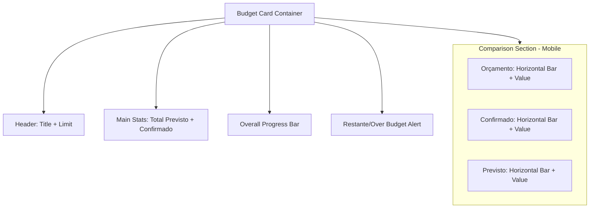

# Mobile Layout Improvement Plan - Budget Overview

The current budget overview card uses a horizontal layout for the comparison charts (Orçamento, Confirmado, Previsto) which becomes cramped on mobile devices, leading to text overflow and poor readability.

## Proposed Changes

### 1. Responsive Grid for Comparison Charts
Instead of a fixed `grid-cols-3`, we will use a responsive grid that stacks vertically on small screens and remains horizontal on larger screens.
- **Mobile**: `grid-cols-1` with horizontal bars or smaller vertical bars in a row if space permits, but stacking is safer for readability.
- **Desktop**: Keep `grid-cols-3`.

### 2. Horizontal Progress Bars for Mobile
Vertical "tank" charts are hard to read when they are very narrow. For mobile, we can switch to horizontal progress bars which allow more room for the currency text.

### 3. Header Reorganization
The header currently has "Confirmado" and "Total Previsto" stacked on the right. We can move these to a more balanced layout on mobile to avoid vertical crowding.

## Mermaid Diagram: Mobile Layout Concept

## Implementation Steps

1.  **Modify `src/components/tabs/ExpensesTab.tsx`**:
    - Update the comparison grid class from `grid grid-cols-3` to `grid grid-cols-1 sm:grid-cols-3`.
    - Adjust the "tank" charts to be shorter or convert them to horizontal rows on mobile.
    - Ensure `formatCurrency` output is handled with `truncate` or `text-xs` on very small screens.
2.  **Refine Header**:
    - Use `flex-col sm:flex-row` for the top section of the card.
3.  **Improve "Restante" section**:
    - Ensure the "Restante" value is prominent but doesn't overlap with the label on narrow screens.

## Todo List for Implementation

- [ ] Change comparison grid to `grid-cols-1 sm:grid-cols-3`
- [ ] Adjust height of vertical bars on mobile or switch to horizontal layout
- [ ] Optimize font sizes for currency values using responsive classes (e.g., `text-xs sm:text-sm`)
- [ ] Test layout on narrow viewport widths
