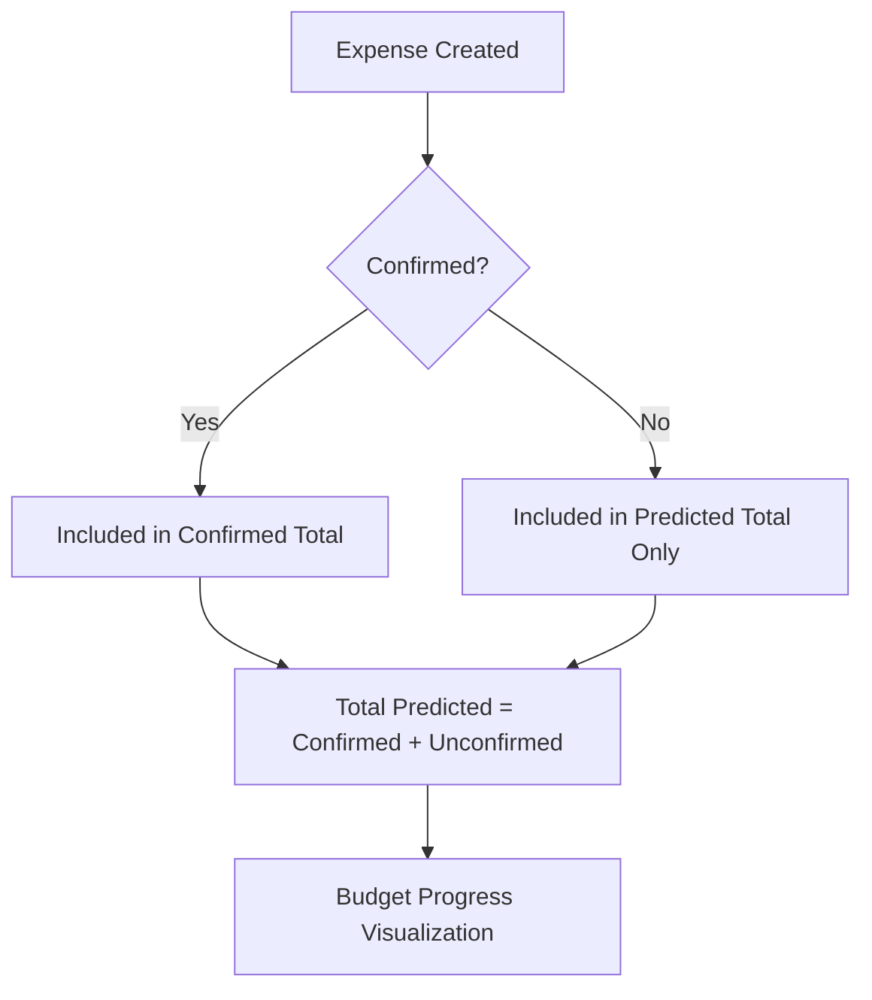

# Plan: Predicted and Confirmed Expenses System

This plan outlines the implementation of a "Confirmed" flag for expenses, allowing users to distinguish between planned (predicted) and actual (confirmed) spending.

## 1. Database Changes
- Create a new migration file `supabase/add_is_confirmed_to_expenses.sql`.
- Add `is_confirmed` boolean column to `public.expenses` table with a default value of `false`.

## 2. Type Definitions
- Update `Expense` interface in [`src/types/index.ts`](src/types/index.ts) to include `is_confirmed: boolean`.

## 3. UI Components

### Expenses Tab ([`src/components/tabs/ExpensesTab.tsx`](src/components/tabs/ExpensesTab.tsx))
- **Budget Overview Card**:
    - Show "Total Confirmado" (sum of confirmed expenses).
    - Show "Total Previsto" (sum of all expenses).
    - Update the progress bar to show confirmed vs. predicted relative to the budget.
    - Update the comparison chart to show two bars for expenses: Confirmed and Predicted.
- **Expense List (Desktop & Mobile)**:
    - Add a checkbox/toggle to mark an expense as confirmed.
    - Visual indicator (e.g., a checkmark icon) for confirmed expenses.
- **Edit Mode**:
    - Add a checkbox for `is_confirmed` in the inline edit form.

### Trip Dashboard ([`src/components/TripDashboard.tsx`](src/components/TripDashboard.tsx))
- **Add Expense Modal**:
    - Add a "Confirmada" checkbox to the creation form.
    - Update `createExpense` to send the `is_confirmed` value to Supabase.

## 4. Logic Updates
- Update `convertedExpenses` useMemo in `ExpensesTab` to include the `is_confirmed` flag.
- Calculate `confirmedTotal` and `predictedTotal` (all) in `ExpensesTab`.

## 5. Verification
- Ensure optimistic updates work when toggling the confirmed flag.
- Verify real-time sync across devices when an expense is confirmed.
