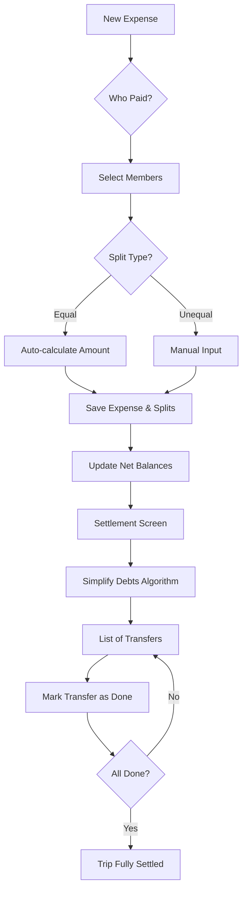

# Data Modeling - Expense Splitting & Settlements

To support the Splitwise-like functionality, we need to extend the current `Expense` model and add new entities for splits and settlements.

## 1. Data Models (TypeScript)

```typescript
// src/types/splitting.ts

export type SplitType = "equal" | "unequal";

export interface ExpenseSplit {
  id: string;
  expense_id: string;
  member_id: string; // The person who owes
  amount: number;    // Calculated or manual amount
  percentage?: number; // Optional: for unequal split by %
}

export interface ExpenseWithSplits extends Expense {
  paid_by_member_id: string; // Who actually paid the bill
  split_type: SplitType;
  splits: ExpenseSplit[];
}

export interface Settlement {
  id: string;
  trip_id: string;
  from_member_id: string; // Debtor
  to_member_id: string;   // Creditor
  amount: number;
  currency: string;
  date: string;
  is_confirmed: boolean; // For partial or final settlement tracking
}

export interface TripSettlementStatus {
  trip_id: string;
  is_settled: boolean;
  settled_at?: string;
}
```

## 2. Debt Simplification Algorithm (Greedy Approach)

The goal is to minimize the number of transactions. We use the **Net Balance** approach.

### Algorithm: `simplifyDebts(balances)`

1. **Calculate Net Balance**: For each person, calculate `Total Paid - Total Owed`.
2. **Filter**: Ignore people with a balance of 0.
3. **Split**: Separate into two lists: `Debtors` (negative balance) and `Creditors` (positive balance).
4. **Sort**: Sort both lists by absolute value (descending).
5. **Match**: While both lists are not empty:
   - Take the largest debtor and largest creditor.
   - The amount to transfer is `min(abs(debtor_balance), creditor_balance)`.
   - Create a transaction: `Debtor pays Creditor X`.
   - Update balances. If a balance becomes 0, remove from list.
   - Repeat.

### Step-by-Step Example (4 Members)

**Initial State:**
- **Ana**: Paid 100, owes 25 -> Net: **+75** (Creditor)
- **Bruno**: Paid 0, owes 25 -> Net: **-25** (Debtor)
- **Carol**: Paid 0, owes 25 -> Net: **-25** (Debtor)
- **Davi**: Paid 0, owes 25 -> Net: **-25** (Debtor)

**Execution:**
1. **Debtors**: [Davi: -25, Carol: -25, Bruno: -25], **Creditors**: [Ana: +75]
2. Davi pays Ana 25. (Davi removed, Ana remains with +50)
3. Carol pays Ana 25. (Carol removed, Ana remains with +25)
4. Bruno pays Ana 25. (Bruno removed, Ana removed)

**Result**: 3 transactions.

**Complexity**: $O(N \log N)$ due to sorting, where $N$ is the number of members. For $N \approx 20$, this is extremely fast (sub-millisecond).

## 3. Logic for Calculating Balances

```typescript
// src/utils/splitting.ts

export interface MemberBalance {
  member_id: string;
  net_balance: number; // Positive = Creditor, Negative = Debtor
}

export function calculateNetBalances(expenses: ExpenseWithSplits[], settlements: Settlement[]): MemberBalance[] {
  const balances: Record<string, number> = {};

  expenses.forEach(expense => {
    if (!expense.is_confirmed) return;

    // Add to payer's credit
    balances[expense.paid_by_member_id] = (balances[expense.paid_by_member_id] || 0) + expense.amount;

    // Subtract from each participant's debt
    expense.splits.forEach(split => {
      balances[split.member_id] = (balances[split.member_id] || 0) - split.amount;
    });
  });

  // Adjust for settlements already made
  settlements.forEach(s => {
    balances[s.from_member_id] = (balances[s.from_member_id] || 0) + s.amount;
    balances[s.to_member_id] = (balances[s.to_member_id] || 0) - s.amount;
  });

  return Object.entries(balances).map(([member_id, net_balance]) => ({
    member_id,
    net_balance
  }));
}

## 5. UI Components Design

### A. Expense Creation (Splitting Section)
- **Payer Selector**: A horizontal scroll or dropdown showing trip members. Defaults to "Me".
- **Split Type Toggle**: "Equal" (default) vs "Unequal".
- **Participant List**:
  - Checkbox for each member.
  - If "Equal": Shows `Total / N` next to each checked member.
  - If "Unequal": Shows an input field for amount/percentage.
  - **Validation**: Total of splits must equal the expense amount.

### B. Balances Summary (People Tab)
- **Net Status**: "You are owed R$ 150" or "You owe R$ 40".
- **Breakdown**: List of members with their individual balance relative to the current user.
  - "João owes you R$ 50" (Green)
  - "You owe Maria R$ 90" (Red)

### C. Trip Settlement Screen
- **Simplification List**: "Ana pays R$ 30 to Carol".
- **Action**: "Mark as Paid" button for each suggested transfer.
- **Final State**: "Trip Settled" badge and confetti when all transfers are confirmed.

## 6. Mermaid Workflow


```

## 4. Edge Cases Handling

- **Rounding**: When dividing 10.00 by 3, we get 3.33, 3.33, 3.34. The logic will check `total_splits !== expense_amount` and add the difference (0.01) to the first participant.
- **Removed Members**: If a member is removed but has a non-zero balance, the UI must prevent removal or flag the "Ghost Debt".
- **Edited Expenses**: Recalculating balances is idempotent; we always compute from the full list of confirmed expenses.
